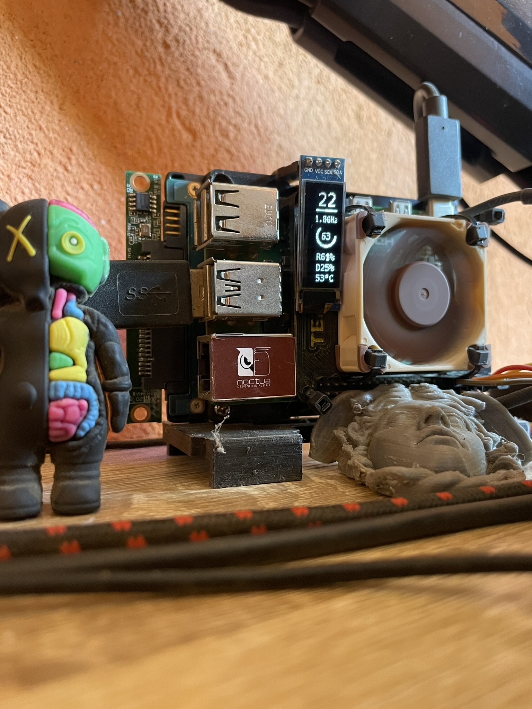

# Raspberry Pi 4 i2c OLED Display for show stats
this project is a simple way to show some stats on a i2c OLED display connected to a Raspberry Pi 4 using Python.
Enjoy!

## Requirements
- Raspberry Pi 4
- i2c OLED Display (128x32)
- Python 3

## Installation 
1. Enable i2c on Raspberry Pi
    * `sudo raspi-config`
    * Go to `Interfacing Options`
    * Go to `I2C`
    * Enable I2C
    * Reboot
2. Install required libraries
    * `pip install smbus2`
    * `pip install psutil`
    * `pip install Pillow`
    * `pip install adafruit-circuitpython-ssd1306`
3. Clone this repository
    * `git clone
4. Run the script for show stats
    * `python3 raspberry_stats.py`

## Use as service (optional)
1. Create a service file
    * `sudo nano /etc/systemd/system/raspberry_stats.service`
2. Copy i2c_python_stats.service content
3. Create a service timer file
    * `sudo nano /etc/systemd/system/raspberry_stats.timer`
4. Copy i2c_python_stats.timer content
5. Enable the service
    * `sudo systemctl enable raspberry_stats.service`
    * `sudo systemctl enable raspberry_stats.timer`
    * `sudo systemctl start raspberry_stats.timer`
3. Reload systemd
    * `sudo systemctl daemon-reload`
4. Check the status of the service
    * `sudo systemctl status raspberry_stats.service`

## Preview



## Implementaciones disponibles

Este repositorio ahora soporta dos variantes para mostrar estadísticas en la pantalla OLED:

1. Python (rápida de modificar / depende de librerías como Pillow y Adafruit)
2. C++ (memoria muy baja, ~1–2 MB RSS, sin dependencias pesadas)

Puedes instalar una u otra (o ambas) usando el `Makefile` con la variable `MODE`.

| Modo | Servicio systemd | Binario / Script | Env file | Características |
|------|------------------|------------------|---------|-----------------|
| Python | `raspberrypi_stats_py.service` | `/usr/local/bin/raspberrypi_stats_py` | `/etc/default/raspberrypi_stats_py` | Fácil de extender, usa Pillow, donut CPU, rotación con PIL |
| C++ | `raspberrypi_stats_cpp.service` | `/usr/local/bin/raspberrypi_stats_cpp` | `/etc/default/raspberrypi_stats_cpp` | Muy ligero, donut CPU, escala proporcional IP, voltaje + throttle, logging periódico |

## C++ port (opcional, low-memory)
La versión C++ bajo `cpp/` habla directo vía I2C al SSD1306 con una fuente 5x7 en memoria. Evita Pillow y reduce uso de RAM a ~1–2 MB. Render vertical (32x128 girado), donut de CPU, voltaje y flags de throttling, y log periódico para `journalctl`.

### Build with Make (simplest)
Dependencies:
```fish
sudo apt-get install -y g++ libi2c-dev
```
Build:
```fish
make
```
Binary output: `build/raspberrypi_stats_cpp`

### Instalar como servicio systemd (ambos modos)
```fish
sudo make install MODE=cpp      # Instala versión C++
sudo make install MODE=python   # Instala versión Python
sudo systemctl daemon-reload
sudo systemctl enable --now raspberrypi_stats_cpp.service   # ó raspberrypi_stats_py.service
```
Archivos de entorno:
- C++: `/etc/default/raspberrypi_stats_cpp`
- Python: `/etc/default/raspberrypi_stats_py` (por ahora reservado)

Variables configurables (C++):
- `RPI_STATS_LOG_INTERVAL` (segundos, default 30)
- `RPI_STATS_UNDERVOLT_THRESH` (volts, default 1.20)

Ver logs (seguimiento en vivo) C++:
```fish
journalctl -u raspberrypi_stats_cpp.service -f

Ver logs Python:
```fish
journalctl -u raspberrypi_stats_py.service -f
```
```

Desinstalar (elimina ambas variantes si existen):
```fish
sudo systemctl disable --now raspberrypi_stats_cpp.service
sudo systemctl disable --now raspberrypi_stats_py.service
sudo make uninstall

### Ejemplos rápidos

Instalar sólo Python y habilitar servicio:
```fish
sudo make install MODE=python
sudo systemctl daemon-reload
sudo systemctl enable --now raspberrypi_stats_py.service
```

Instalar sólo C++ y habilitar servicio:
```fish
sudo make install MODE=cpp
sudo systemctl daemon-reload
sudo systemctl enable --now raspberrypi_stats_cpp.service
```

Cambiar intervalo de log (C++):
```fish
sudo sed -i 's/RPI_STATS_LOG_INTERVAL=.*/RPI_STATS_LOG_INTERVAL=10/' /etc/default/raspberrypi_stats_cpp
sudo systemctl restart raspberrypi_stats_cpp.service
```

Ver última línea de log C++:
```fish
journalctl -u raspberrypi_stats_cpp.service -n 1
```

## Notas sobre dependencias Python

Asegúrate de tener instalados (ejemplo con pip):
```fish
pip install psutil Pillow adafruit-circuitpython-ssd1306 smbus2
```
Si usas entorno virtual, ajusta la unidad systemd para apuntar al intérprete correcto (modifica `ExecStart=` en `raspberrypi_stats_py.service`).
```

### Alternative: build with CMake
```fish
sudo apt-get install -y cmake g++ libi2c-dev
cmake -S cpp -B cpp/build
cmake --build cpp/build
./cpp/build/raspberrypi_stats_cpp
```

Si prefieres configuración manual, crea una unidad systemd propia apuntando al binario/script y recarga con `systemctl daemon-reload`.
