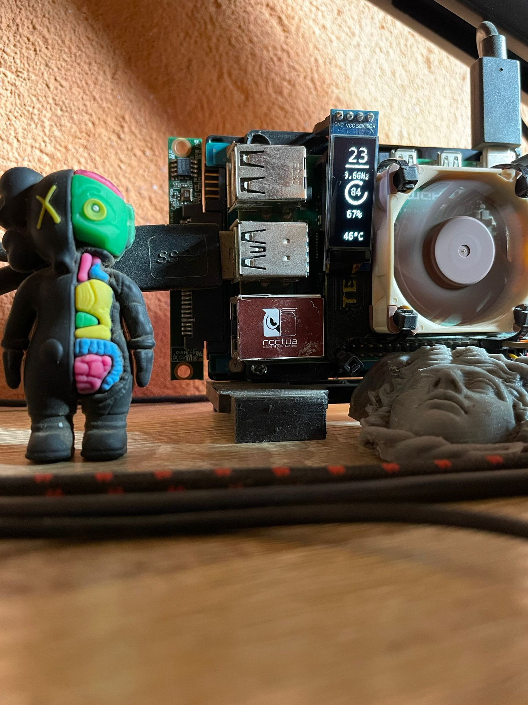
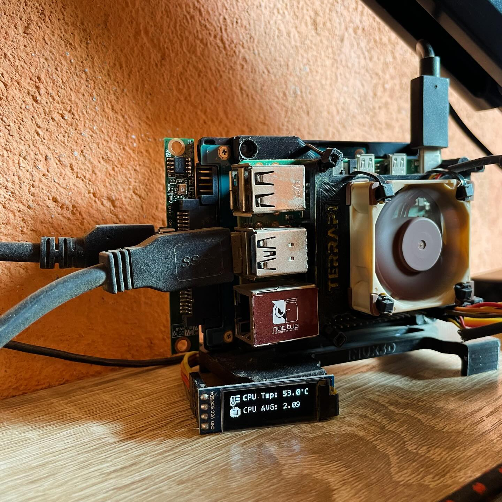

# Raspberry Pi 4 i2c OLED Display for show stats
this project is a simple way to show some stats on a i2c OLED display connected to a Raspberry Pi 4 using Python.
Enjoy!

## Requirements
- Raspberry Pi 4
- i2c OLED Display (128x32)
- Python 3

## Installation 
1. Enable i2c on Raspberry Pi
    * `sudo raspi-config`
    * Go to `Interfacing Options`
    * Go to `I2C`
    * Enable I2C
    * Reboot
2. Install required libraries
    * `pip install smbus2`
    * `pip install psutil`
    * `pip install Pillow`
    * `pip install adafruit-circuitpython-ssd1306`
3. Clone this repository
    * `git clone
4. Run the script for show stats
    * `python3 raspberry_stats.py`

## Use as service (optional)
1. Create a service file
    * `sudo nano /etc/systemd/system/raspberry_stats.service`
2. Copy i2c_python_stats.service content
3. Create a service timer file
    * `sudo nano /etc/systemd/system/raspberry_stats.timer`
4. Copy i2c_python_stats.timer content
5. Enable the service
    * `sudo systemctl enable raspberry_stats.service`
    * `sudo systemctl enable raspberry_stats.timer`
    * `sudo systemctl start raspberry_stats.timer`
3. Reload systemd
    * `sudo systemctl daemon-reload`
4. Check the status of the service
    * `sudo systemctl status raspberry_stats.service`

## Preview

